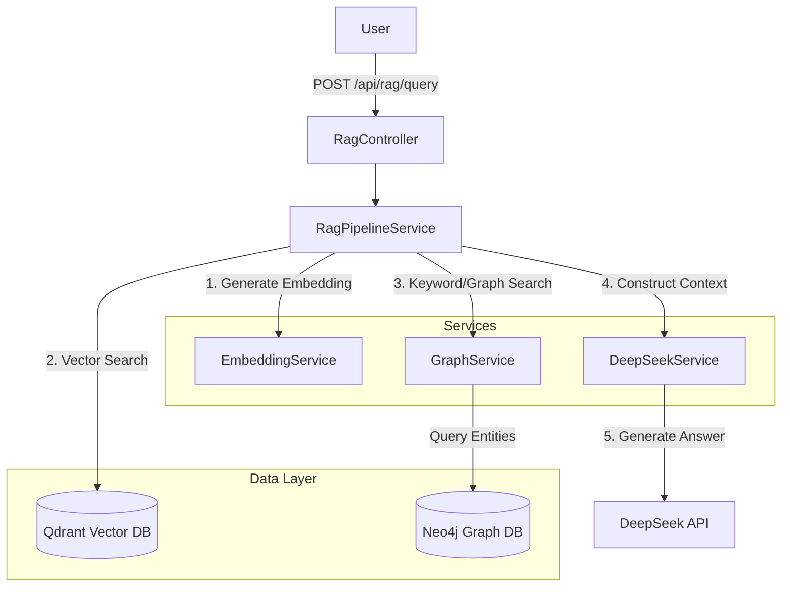

# RAG Chatbot - Project Architecture & Flow

This document provides a technical overview of the RAG (Retrieval-Augmented Generation) Chatbot project, designed for a high-level walkthrough with technical depth.

## 1. High-Level Architecture

The system is a **Spring Boot** application that acts as an orchestration layer between three primary state ful components and an external LLM provider.

### Tech Stack
- **Core Framework**: Java 21, Spring Boot 3.4.0
- **Vector Database**: Qdrant (running in Docker) - *For semantic search*
- **Graph Database**: Neo4j (running in Docker) - *For structured relationship context*
- **LLM Provider**: DeepSeek API - *For generating natural language responses*
- **Build Tool**: Maven

### Architecture Diagram

## 2. Detailed Data Flow

Here is the step-by-step lifecycle of a user query (`/api/rag/query`):

### Step 1: Request Handling
The `RagController` receives the raw text query.

### Step 2: Vector Retrieval (The "Unstructured" Context)
The `RagPipelineService` first attempts to find semantically similar documents.
1.  **Embedding Generation**: The query is passed to `EmbeddingService`.
    *   *Current Implementation Note*: Retrieves a 384-dimensional float vector. Currently uses a **deterministic hash-based placeholder** (Random with seed) for MVP scaffolding. In production, this would be an ONNX model (e.g., BGE-Small) or an external embedding service.
2.  **Qdrant Query**: The vector is sent to Qdrant via `QdrantService`.
    *   It performs a Cosine Similarity search.
    *   Returns the top 3 closest document chunks.

### Step 3: Graph Retrieval (The "Structured" Context)
The system then fetches accurate, structured facts that might be missed by probabilistic vector search.
1.  **Context Fetch**: `GraphService` is called with the query.
2.  **Neo4j Lookup**:
    *   *Current Implementation Note*: Performs a keyword/name search in Neo4j (`GraphEntityRepository.searchByName`) to find entities mentioned in the query.
    *   *Future Capability*: Can be expanded to traverse relationships (e.g., "Find all suppliers related to this Product").

### Step 4: Context Synthesis
The application combines the two retrieval sources:
> **Vector Context**: "Text chunk mentioning project Alpha..." (from Qdrant)
> **Graph Context**: "Entity: Project Alpha (Type: Initiative), Description: Q4 Core Focus" (from Neo4j)

### Step 5: LLM Generation
The combined context + original query is sent to `DeepSeekService`.
*   A prompt is constructed: *"Use the following context to answer the user's question..."*
*   The DeepSeek API generates the final natural language response.

## 3. Data Ingestion (How data gets there)

When documents are indexed (`/api/rag/ingest`):
1.  **Text Split**: Content is processed (raw text).
2.  **Vector Store**:
    *   Embedding generated.
    *   Stored in **Qdrant** (Point struct: ID, Vector, Payload={text}).
3.  **Graph Extraction**:
    *   The text is sent to the LLM (DeepSeek) with a prompt: *"Extract entities and relationships from this text"*.
    *   The LLM returns JSON data (Entities: [A, B], Relations: [A -> B]).
    *   These are stored in **Neo4j** as Nodes (`GraphEntity`) and Relationships (`GraphRelation`).

## 4. Key Talking Points for CTO
*   **Hybrid RAG**: We don't rely only on Vectors (which can hallucinate or miss precise connections) or only on Graph (which requires strict schemas). We use both.
*   **Modular Design**: The Embedding model, Vector Store, and LLM are all behind interfaces. Switching from DeepSeek to GPT-4 or Qdrant to Pinecone is a code-level configuration change, not a rewrite.
*   **Scaffolding Ready**: The entire plumbing (API -> Docker -> DBs -> LLM) is functional. The next step is simply swapping the "Mock/Hash" embedding model for a real ONNX model to turn on "real" semantic understanding.
